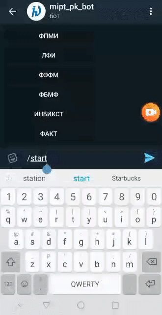

## mipt_pk_bot
Bot for selection committee of MIPT univercity, from MIPT Hack 2020.
You can check it [here](https://t.me/FreeFlowBot).

Used technologies:
  - AWS Lambda and API gaeway
  - MySQL
  - Python (PyTeleBotAPI)
  
My role and achievments:
  - Deploying bot in cloud
  - Merging and wrapping teammates scripts in User_bot class (compare, bot.py and others)
  - Fixing all major bugs to prevent bot falling

### Video user-experience example

